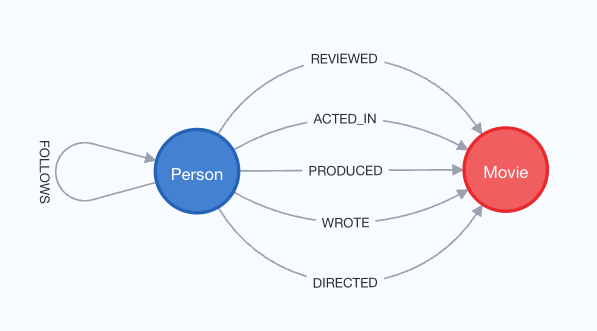

= Spring Data Neo4j Intro App

This application's goal is to provide a minimum REST API functionality for using Spring Data Neo4j with SpringBoot and Neo4j graph database. The project uses the following technologies:

* Spring Data Neo4j
* Spring Boot

Previous technologies (SDN5+OGM) are shown on the `sdn5` branch of this repository.

== Data set

The data set uses the movie data set (a Neo4j favorite), describing movies and the people connected to them (actors, directors, etc).

== Resources

* Documentation: https://docs.spring.io/spring-data/neo4j/reference/[Spring Data Neo4j^]